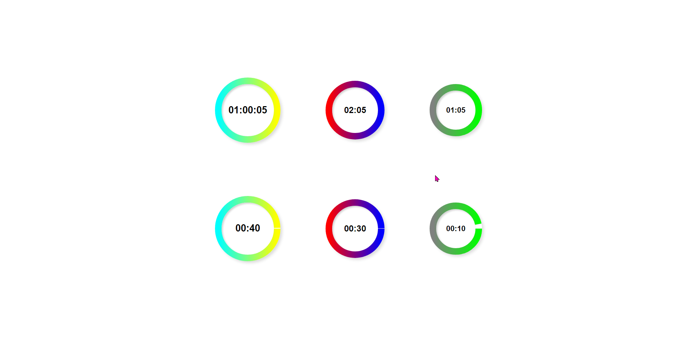

# Circular-Countdown-React

### This NPM package provides a reusable countdown timer component for ReactJS applications. It allows developers to easily implement a countdown feature with customizable options such as size, color, and duration. The component is built using ReactJS, CSS, Styled-Components and ESLINT to ensure optimal design and functionality. <br />


---

**Live demo:** </br>[circular-countdown-react](https://afektheminilearner.github.io/countdown-react/)

---

## Configuration Options

### This circular countdown component offers a variety of configuration options to customize its appearance and functionality, including:

- **size**: The countdown can be displayed in 3 sizes: large, medium, small.
- **color1 & color2**: The countdown is styled using 'gradient color' which made by combining two colors which are configurable.
- **totalSeconds**: The duration of the countdown in total seconds.
- **onDone**: Its optional to pass a function the will be executed when the countdown finishes.
- **shouldStop**: Its optional to allow the countdown to be more responsive by passing here state that can change as you need to, otherwise it can be used as static countdown.

</br>

## Usage

**Example of using the countdown in react app file, customized with the mentioned props**:

```js
import React from "react";
import { Countdown } from "circular-countdown-react";

function App() {
  return (
    <div className="app-container">
      <Countdown
        color1="cyan"
        color2="yellow"
        size="large"
        totalSeconds={60}
        onDone={() => console.log("Done!")}
        shouldStop={false}
      />
    </div>
  );
}

export default App;
```

**Installation:**</br>
run the following command on your terminal:</br> _`npm install circular-countdown-react`_

---

### **Example of using the countdown component:**



---

## Author

:octocat: **Afek Sakaju**

- LinkedIn: [@afeksa](https://www.linkedin.com/in/afeksa/)
- GitHub: [@afekTheMiniLearner](https://github.com/afekTheMiniLearner)
